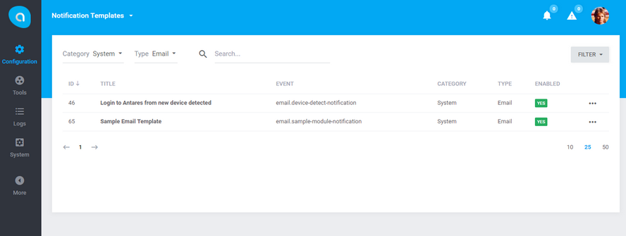

# Antares Notifications Module

Notifications module is responsible for configuration interface of notification templates and sending notifications to users in the system. It handles email and sms notifications, but also displays alerts (the bell icon) to the users. It allows administrator to set up their own text and supports multi-language.

## Documentation

Antares Notifications Module documentation [docs.antaresproject.io/php-framework/core-modules/notifications](http://www.docs.antaresproject.io/php-framework/core-modules/notifications).

Full Antares documentation can be found at [docs.antaresproject.io/php-framework](http://www.docs.antaresproject.io/php-framework).

## Changelog

Antares Notifications changelog can be found in release notes [docs.antaresproject.io/php-framework/getting-started/changelog#notifications](http://www.docs.antaresproject.io/php-framework/getting-started/changelog#notifications).

You can find full Antares changelog in Antares Documentation [docs.antaresproject.io/php-framework/getting-started/changelog](http://www.docs.antaresproject.io/php-framework/getting-started/changelog).

## Issues

The issue list of this repo is **exclusively** for bug reports and feature requests.

Please follow [Issue Reporting Guide](http://www.docs.antaresproject.io/php-framework/getting-started/issues-reporting-guide) before opening an issue. Issues not following the guide will be closed without further investigation.

## Contribution

Please follow [Contribution Guide](http://www.docs.antaresproject.io/php-framework/getting-started/contribution-guide) before making a pull request.

## Community

* Twitter: @antaresproject
* Forum: (coming soon)
* Blog: (coming soon)
* Email: contact (at) antaresproject.io

## License

This software is released under the BSD 3-Clause License.

© 2017 INBS.Software.
